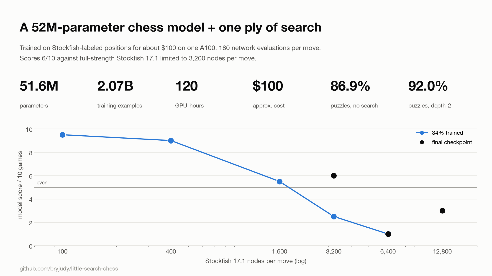
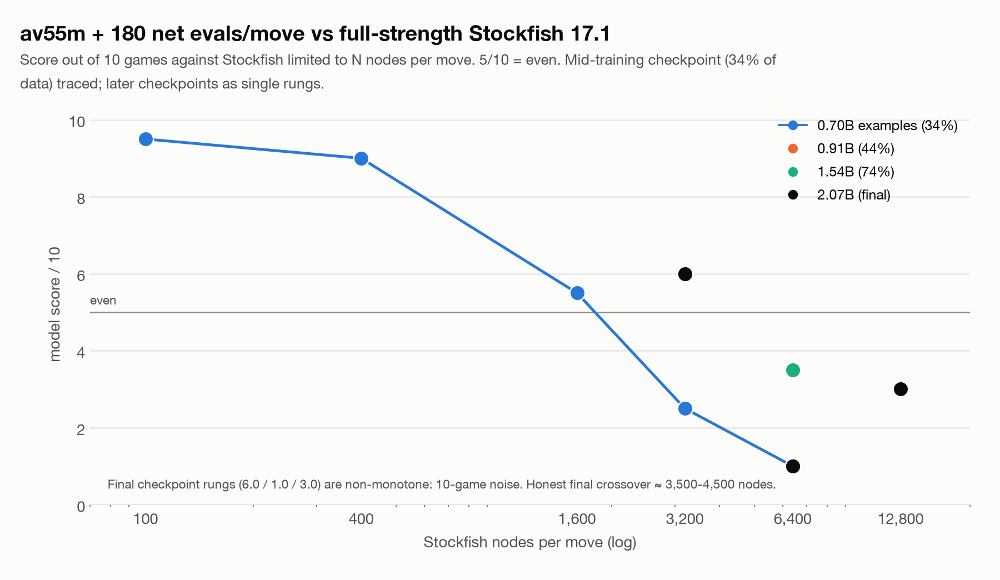
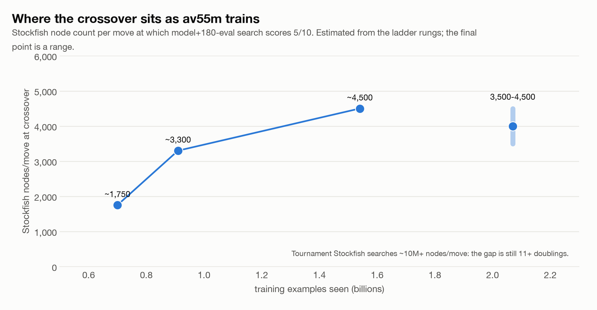
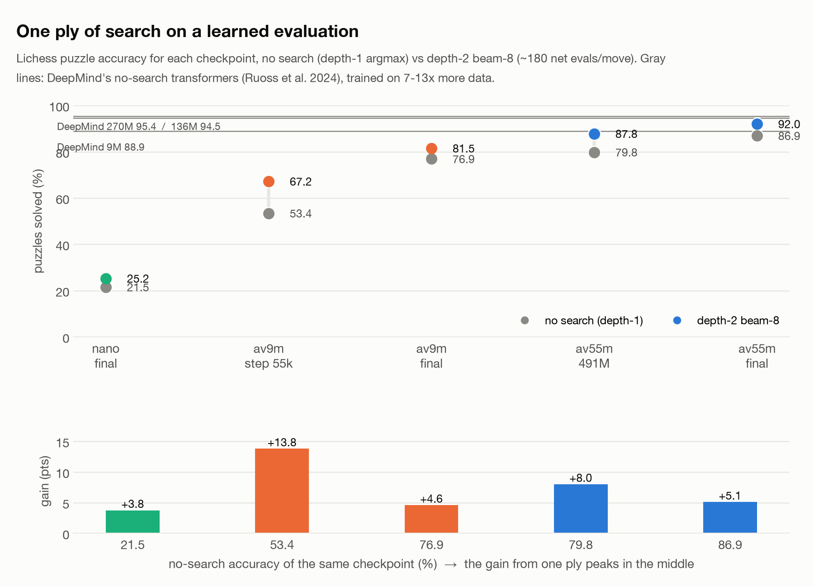
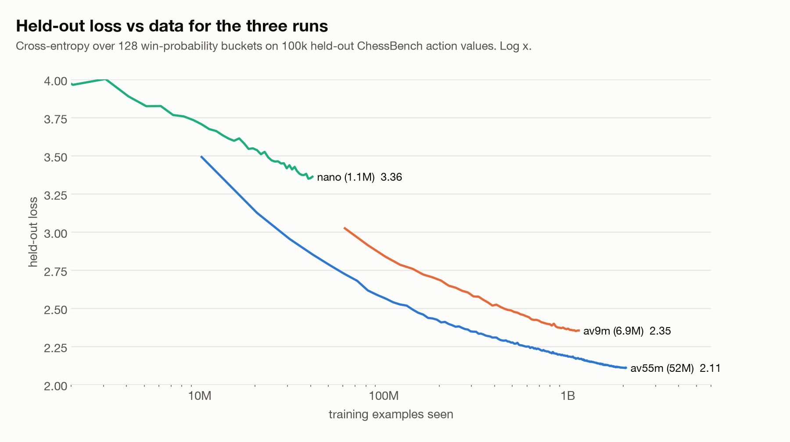

# little-search-chess

Small chess transformers that predict Stockfish's evaluation of each move, plus one or two plies of batched search on top. The question: how much does a little search amplify a learned evaluation, and how many nodes of full-strength Stockfish is that worth?

DeepMind's ChessBench paper showed a 270M-parameter transformer plays grandmaster-level blitz with no search at all. Stockfish is the opposite extreme: a tiny evaluation and an enormous search. This repo sits in the middle. I trained three action-value models (1M, 7M and 52M parameters) on Stockfish-labeled positions for a total of about $120 of rented GPU time, put a depth-2 beam search on top (~180 network evaluations per move, one or two batched GPU forwards), and played them against Stockfish 17.1 with a node limit per move.



## Results

The 52M model with ~180 evaluations per move is roughly even with full-strength Stockfish 17.1 searching 3,500-4,500 nodes per move. The mid-training checkpoint (34% of the data) traced a clean sigmoid from 9.5/10 at 100 nodes to 1.0/10 at 6,400, and the crossover kept moving right as training continued.

| model | params | examples seen | GPU time | cost | held-out loss | puzzles d1 | puzzles d2 | Stockfish crossover (nodes/move) |
|---|---|---|---|---|---|---|---|---|
| nano | 1.1M | 41M | 10 h CPU | ~$0 | 3.34 | 21.5% | 25.3% | far below 100 |
| av9m | 6.9M | 1.15B | 24 h A100 | ~$20 | 2.35 | 76.9% | 81.5% | not measured |
| av55m | 51.6M | 2.07B | 120 h A100 | ~$100 | 2.11 | 86.9% | 92.0% | ~3,500-4,500 |

Puzzles: the first 1,000 of DeepMind's Lichess puzzle set (400 for nano), solved only if every model move matches the solution or delivers an alternative checkmate. d1 = argmax over the net's action values, no search. d2 = depth-2 beam-8 search. For reference, DeepMind's no-search 9M / 136M / 270M models score 88.9 / 94.5 / 95.4% on the same puzzle source, trained on 15.3B examples (7-13x more than these runs).





### Search amplification is an inverted U

The gain from one ply of search depends on how good the evaluation already is. It was +3.8 points at nano scale, +13.8 points for a half-trained 7M model, then +4.6 for the same model fully trained, +8.0 for half-trained av55m and +5.1 for the final av55m. Search helps most when the evaluation is decent but not yet sharp. Against skill-capped Stockfish the same thing shows: one ply of search moved av9m from 5.0/10 at skill 2 to 8.5/10 at skill 3.





### Caveats, stated plainly

- Every match is 10 games. The final-checkpoint ladder rungs (6.0 at 3,200, 1.0 at 6,400, 3.0 at 12,800) are non-monotone, which is exactly what 10-game noise looks like. That is why the crossover is a range. Use 30+ games per rung if you rerun this.
- Stockfish ran single-threaded with the default hash. Skill-capped matches used 50 ms per move; the ladder used a hard node limit. The model side ran on an A100.
- Tournament Stockfish searches tens of millions of nodes per move. The gap from here is 11+ doublings. This is a scaling curve, not a claim to have beaten Stockfish.
- Puzzle accuracy is on the first n rows of the puzzle CSV, not a random sample, and n is 1,000 rather than DeepMind's 10,000.
- The 9M-vs-DeepMind comparison is not apples to apples: their models saw 7-13x more data and the puzzle sample differs.

All numbers are in [results/results.json](results/results.json); per-step training logs are in [results/train_logs/](results/train_logs/). The build log with the day-by-day story is [docs/LOG.md](docs/LOG.md).

## What is in the box

- `chesscore.py`: ChessBench bagz reader and record decoder, DeepMind-compatible FEN tokenizer (77 tokens, 31-symbol vocab), the 1968-move action table, 128-bucket win-probability targets, and the PyTorch action-value transformer. Input is 77 FEN tokens plus one action token; output is a distribution over win-probability buckets.
- `search.py`: batched pruned minimax on the action values. Depth 1 scores every legal move in one forward. Depth 2 keeps the top K moves and scores every reply to each in one batch, taking the worst case. Root does an exhaustive mate-in-1 scan so pruning can never miss a mate. `widths=()` is no search, `(8,)` is depth-2 beam-8, `(8, 6)` is depth-3.
- `prep_data.py`: downloads and tokenizes ChessBench action-value shards into memmap-able .npy files.
- `train.py`: single-GPU bf16 trainer, resumable, JSONL log, cosine schedule, escape hatches for flaky virtualized GPUs.
- `evaluate.py`: puzzle accuracy and matches against Stockfish (skill-capped or node-limited).
- `nodes_bench.py`: runs the node ladder.
- `play.py`: play the model in the terminal, or ask it about a position.
- `scripts/make_figures.py`: renders every figure above from `results/`.

## Checkpoints

Weights are on the [releases page](https://github.com/bryjudy/little-search-chess/releases) (optimizer state stripped):

| file | params | config | size |
|---|---|---|---|
| `av55m.pt` | 51.6M | d512, 16 layers, 16 heads | 206 MB |
| `av9m.pt` | 6.9M | d256, 8 layers, 8 heads | 28 MB |
| `nano.pt` | 1.1M | d128, 4 layers, 4 heads | 4 MB |

Each file is `{"model": state_dict, "config": {...}, "step": int}` and loads with `build_model(**config)`.

## Reproduce

Python 3.11+, PyTorch, python-chess, numpy, pandas. [uv](https://docs.astral.sh/uv/) works well:

```
uv sync
mkdir -p release && curl -L -o release/av55m.pt https://github.com/bryjudy/little-search-chess/releases/download/v0.1/av55m.pt
curl -L -o data/puzzles.csv https://storage.googleapis.com/searchless_chess/data/puzzles.csv --create-dirs

uv run python play.py --ckpt release/av55m.pt --fen "r1bqkbnr/pppp1ppp/2n5/4p3/4P3/5N2/PPPP1PPP/RNBQKB1R w KQkq - 2 3"
uv run python evaluate.py puzzles --ckpt release/av55m.pt --n 1000 --widths ""     # no search
uv run python evaluate.py puzzles --ckpt release/av55m.pt --n 1000 --widths 8      # depth-2 beam-8
```

Matches need a Stockfish binary (`brew install stockfish`, or point `--sf` / `$STOCKFISH` at one):

```
uv run python evaluate.py match --ckpt release/av55m.pt --games 10 --sf_skill 5 --widths 8
uv run python nodes_bench.py --ckpt release/av55m.pt --nodes 100 400 1600 3200 6400 --games 30 --widths 8
```

Training from scratch (a GPU with 40+ GB and datacenter bandwidth; 48 shards is 413M examples, ~30 GB):

```
uv run python prep_data.py 48
uv run python train.py --run av9m  --d_model 256 --n_layers 8  --batch 4096 --hours 24
uv run python train.py --run av55m --d_model 512 --n_layers 16 --batch 2048 --hours 120 --cosine_steps 1080000
```

The CPU/MPS path works for evaluation and play (the numbers above were smoke-tested on an M-series Mac), but do not train on Apple MPS with this model: it was 10-40x slower than CPU and deadlocked in AdamW.

## Credits

Data, tokenizer scheme, action space and the action-value recipe come from DeepMind's [searchless_chess](https://github.com/google-deepmind/searchless_chess) and the paper Ruoss et al., *Amortized Planning with Large-Scale Transformers: A Case Study on Chess* (NeurIPS 2024, [arXiv:2402.04494](https://arxiv.org/abs/2402.04494)). See [NOTICE](NOTICE). Stockfish is by the Stockfish developers (GPL-3.0) and is not distributed here.

MIT License. If you use this, please cite it (see [CITATION.cff](CITATION.cff)).
